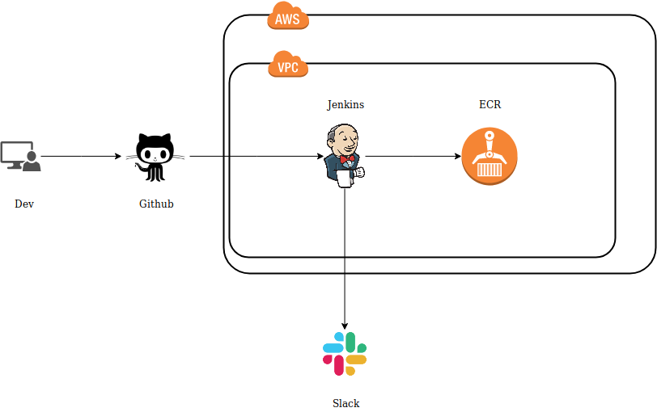

# Continuous Integration

A continuous integration system is implemented in order to automate tests and the creation of Docker images after code updates.

 

The Code is stored in [Github](https://github.com/Taraxa-project/taraxa-node) and it notifies every change to the Continuous Integration Tool, that in our case is [Jenkins](https://35.167.79.40/), using Webhooks. These webhooks have to be set up in [Github Settings](https://github.com/Taraxa-project/taraxa-node/settings).

Jenkins will receive notifications from Github and it will begin to execute the actions that we have specified in [Jenknsfile](https://github.com/Taraxa-project/taraxa-node/blob/master/Jenkinsfile). The current actions are:

* Log into [ECR](https://us-west-2.console.aws.amazon.com/ecr/repositories?region=us-west-2) (Docker Registry)
* Run Unit Tests
* Build Docker Image
* Test Docker Image using Smoke Tests
* Push Docker Image to [ECR](https://us-west-2.console.aws.amazon.com/ecr/repositories?region=us-west-2) (Docker Registry) if it is the master branch

The result will be communicated to Slack.